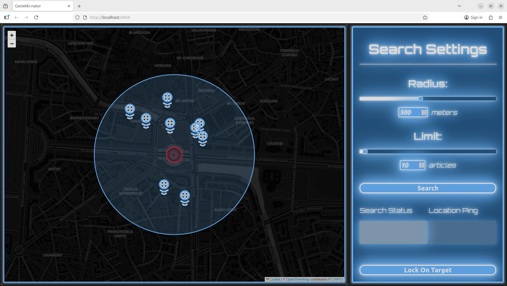
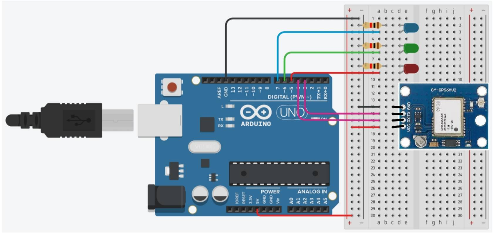

# GeoWiki-nator&copy;&trade;&reg;
**GeoWiki-nator&copy;&trade;&reg;** *(not actualy copyrighted, trademarked or registered)* is an educational tool aimed at helping turists and even locals with their journey on learning more about their surroundings.

Users can walk around with an [arduino device](#arduino-device) and, at a click away, have all of the [Wikipedia](https://wikipedia.com) articles relevent to the world around them displayed to them via a geeky local [webserver](#webserver).

For basic information about both, click on [this for the arduino device](#arduino-device) or [this for the webserver](#webserver) to go their respecitve headers.

**To go more in depth, please check out the [wiki of this project](https://github.com/DraDN/GeoWiki-nator/wiki).**

# Arduino device

click here to expand

## Installing
Components needed:
- Arduino
- GPS module
- 3 LEDs

### Wiring diagram

 

# Webserver

click here to expand

All of the code related to the webserver is inside the `./webserver/` folder of the repo

<!--  -->

## Installing

*Node.js is required for this project.
Click [here](https://nodejs.org/en/download) to see how to install Node.js*

All required modules are already inside `package.json`, so,**whilst inside the `./webserver/` folder**, you just need to run:

`npm install`

After that, everything should be set up.

## Usage

### Start the server

To start the webserver, run **inside the `./webserver/` directory**:

`npm start`

From this point, you can access the website at http://localhost:6969

