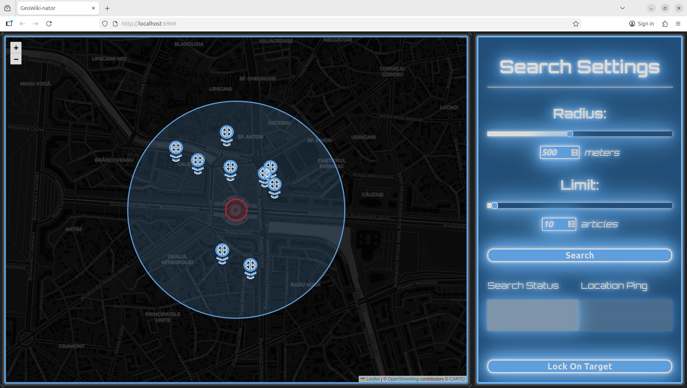
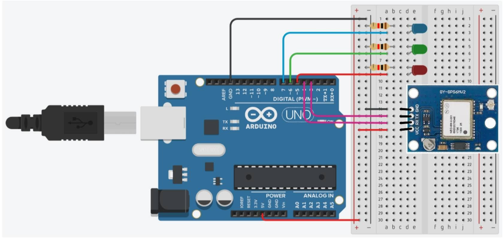

# GeoWiki-nator&copy;&trade;&reg;
**GeoWiki-nator&copy;&trade;&reg;** *(not actualy copyrighted, trademarked or registered)* is an educational tool aimed at helping turists and even locals with their journey on learning more about their surroundings.

Users can walk around with an [arduino device](#arduino-device) and, at a click away, have all of the [Wikipedia](https://wikipedia.com) articles relevent to the world around them displayed to them via a geeky local [webserver](#webserver).

For basic information about both, click on [this for the arduino device](#arduino-device) or [this for the webserver](#webserver) to go their respecitve headers.

**To go more in depth, please check out the [wiki of this project](https://github.com/DraDN/GeoWiki-nator/wiki).**

## 🔌 Arduino device

click here to expand

Acest modul hardware acționează ca unitate centrală de **colectare** a datelor pentru sistemul Wikinator. Rolul său este de a intercepta coordonatele geografice și de a oferi feedback vizual utilizatorului.

### ⚙️ Mod de funcționare

* **Localizare:** Modulul GPS recepționează semnale de la sateliți pentru a determina latitudinea și longitudinea curentă.
* **Procesare:** Arduino preia datele brute de la GPS (prin protocol serial), le procesează și le trimite către serverul web pentru a fi mapate.
* **Feedback Vizual:** Cele 3 LED-uri indică starea sistemului:
    * 🔵 **LED 1:** Căutare semnal GPS.
    * 🟢 **LED 2:** Conexiune activă la server / Date trimise cu succes.
    * 🔴 **LED 3:** Eroare sistem sau lipsă semnal.

### 🛠️ Conectare (Wiring)

Pentru a asambla dispozitivul, urmează schema de cablare respectând aceste conexiuni:

#### **GPS Module**
| Pin GPS | Pin Arduino | Notă |
| :--- | :--- | :--- |
| **VCC** | 5V | Alimentare |
| **GND** | GND | Împământare |
| **TX** | D3 | Transmisie Date (SoftwareSerial) |
| **RX** | D4 | Recepție Date (SoftwareSerial) |

#### **LED-uri**
* Fiecare LED trebuie conectat în serie cu un **rezistor de 220Ω** pentru a preveni arderea.
* **Anodul** (piciorușul lung) se conectează la pinii digitali (ex: D8, D9, D10).
* **Catodul** (piciorușul scurt) se conectează la **GND**.

#### **Alimentare**
* Prin cablu **USB tip B** conectat la computer sau la o sursă de alimentare externă (Power Bank/Adaptor 5V).

## Installing
Components needed:
- Arduino
- GPS module
- 3 LEDs

### Wiring diagram

 

# Webserver

click here to expand

All of the code related to the webserver is inside the `./webserver/` folder of the repo

<!--  -->

## Installing

*Node.js is required for this project.
Click [here](https://nodejs.org/en/download) to see how to install Node.js*

**Clone the repositry locally**.

All required modules are already inside `package.json`, so,**whilst inside the `./webserver/` folder**, you just need to run:

`npm install`

After that, everything should be set up.

#### Dependencies

The webserver uses:
* Node.js packages:
    * express
    * serialport
    * socket.io
* Leaflet map embed
    * OpenStreetMap and CARTO tile map layers

## Usage

### Start the server

To start the webserver, run **inside the `./webserver/` directory**:

`npm start`

From this point, you can access the website at http://localhost:6969

